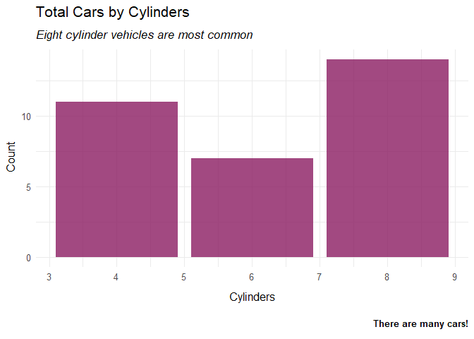

<!-- README.md is generated from README.Rmd. Please edit that file -->

# cousepkg

<!-- badges: start -->
<!-- badges: end -->

The goal of cousepkg is to make plots pretty using a custom theme and
`ggtext::element_markdown()` objects and provide my own RMarkdown
template.

## Installation

`cousepkg` requires the install of the [IBM Plex
Sans](https://github.com/IBM/plex/). The package relies on
[ragg](https://github.com/r-lib/ragg) for access to system fonts.

install development version from [GitHub](https://github.com/) with:

``` r
# install.packages("devtools")
devtools::install_github("joeycouse/cousepkg")
```

## Example

This is a basic example which shows you how to solve a common problem:

``` r
library(tidyverse)
#> -- Attaching packages --------------------------------------- tidyverse 1.3.1 --
#> v ggplot2 3.3.5     v purrr   0.3.4
#> v tibble  3.1.6     v dplyr   1.0.7
#> v tidyr   1.1.4     v stringr 1.4.0
#> v readr   2.1.1     v forcats 0.5.1
#> -- Conflicts ------------------------------------------ tidyverse_conflicts() --
#> x dplyr::filter() masks stats::filter()
#> x dplyr::lag()    masks stats::lag()
library(cousepkg)
theme_set(theme_couse())

mtcars %>%
  ggplot(aes(x = cyl))+
  geom_bar()+
  labs(x = 'Cylinders',
       y = 'Count',
       title = 'Total Cars by Cylinders',
       subtitle = '*Eight cylinder vehicles are most common*',
       caption = '**There are many cars!**')
```



## Source

cousepkg is largely inspired by data visualizations from
[juliasilge](https://github.com/juliasilge) and her personal R Package
[silgelib](https://github.com/juliasilge/silgelib)
